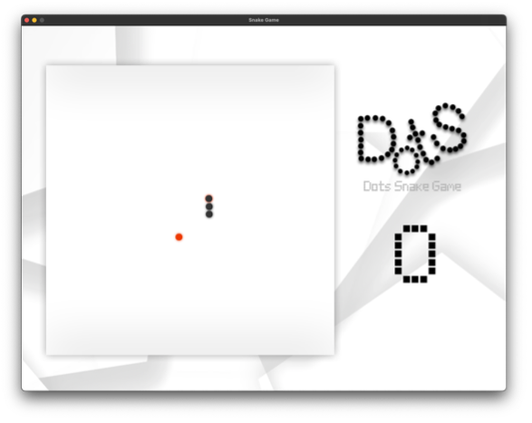
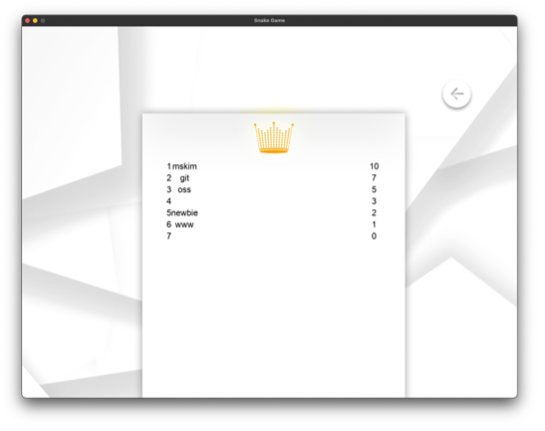
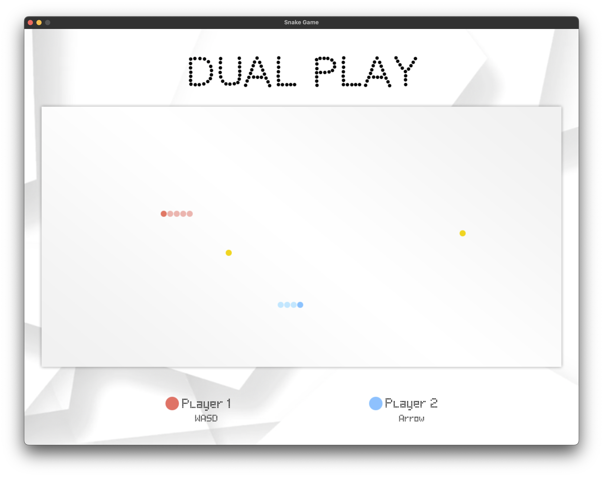

<br />
<br />
<div align="center">
    

  <h3 align="center"> DotS </h3>

  <p align="center">
    <em>Simple. Modern.</em>
    <br />
    <br />
  </p>
</div>
<br />
<br />

# About This Project

**Dots**(Dots Snake Game) is a GUI based pc game that is a derivative version of snake game.

_This project is a assignment of OSS(Open Source SW Project), [CSE, CAU](http://cse.cau.ac.kr)_

<br>
<br>

# Snapshot

| Menu                      | Single Play               | Rank                      |
| ------------------------- |---------------------------| ------------------------- |
|  |  |  |

| Dual Play            | Auto Play                      |
|----------------------|--------------------------------|
|  |  |
<br>
<br>

# Installation

1. Install [python(v3.x)](https://www.python.org/downloads), [pygame](https://www.pygame.org/wiki/GettingStarted), [git](https://git-scm.com/downloads)

2. Clone the remote repository from github

```bash
$ git clone https://github.com/CAU-2022-OSS/snake-game.git
```

3. Install font in **static/font/poxel.ttf**

4. Move to src directory

```bash
$ cd snake-game/src
```

5. Execute main.py

```bash
$ python main.py
// or (depend on your version)
$ python3 main.py
```


# Contributor

<table width="900">
<thead>
    <tr>
        <th width="70" align="center">Name</th>
		<th width="80" align="center">Department</th>
        <th width="250" align="center">Role</th>
        <th width="150" align="center">Github</th>
    </tr> 
</thead>

<tbody>
    <tr>
       <td width="70" align="center">공예지</td>
		<td width="80" align="center">소프트웨어학부</td>
        <td width="250" align="center">Menu / Data Logic dev</td>
        <td width="150" align="center">	
	        <a href="https://github.com/YejiGong">
	            
	        </a>
        </td>
    </tr>
    <tr>
        <td width="70" align="center">권혁민</td>
		<td width="250" align="center">소프트웨어학부</td>
        <td width="250" align="center">Game Logic dev</td>
        <td width="150" align="center">	
	        <a href="https://github.com/ArfiTech">
	            
	        </a>
        </td>
    </tr>
    <tr>
        <td width="70" align="center">김명승</td>
		<td width="250" align="center">소프트웨어학부</td>
        <td width="250" align="center">UI, Documentation</td>
        <td width="150" align="center">	
	        <a href="https://github.com/mskim9967">
	            
	        </a>
        </td>
    </tr>
    <tr>
   
</tbody>
</table>
<br>
<br>

# Used Opensource

| Library                                   | License           | Description  |
| ----------------------------------------- | ----------------- | ------------ |
| [pygame](https://www.pygame.org)          | LGPL              | Base library |
| [poxel](https://blogfonts.com/poxel.font) | NO COMMERCIAL USE | Font         |

<br/>
<br/>

---

 <a href='https://github.com/CAU-2022-OSS/snake-game/blob/main/LICENSE'>
	GNU LESSER GENERAL PUBLIC LICENSE (LGPL)
    <br />
   	Copyright ⓒ 2022 CAU-2022-OSS
</a>
